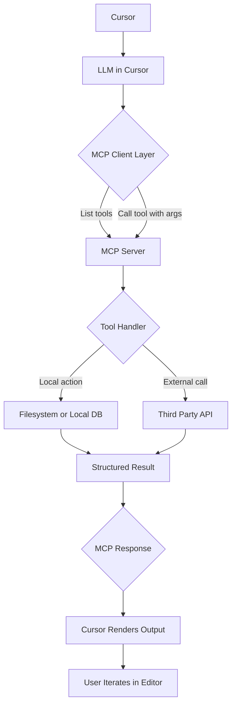

## Overview

This hackathon is about building **MCP (Model Context Protocol) servers** that work inside **Cursor**. You can build in **any language or framework**. Python with **FastMCP** is a recommended setup because it is quick to prototype and easy to demo inside Cursor.

---

## Goals

- Learn how MCP plugs into Cursor
- Build and demo your own MCP server
- Explore unique ideas that go beyond existing connectors

---

## Architecture at a Glance



---

## Getting Started

### Fast path in Python with FastMCP

```bash
git clone <https://github.com/modelcontextprotocol/fastmcp-starter>
cd fastmcp-starter
pip install -r requirements.txt
python server.py

```

Add to `.cursor/config.json`:

```json
{
  "mcpServers": {
    "fastmcp-demo": {
      "command": "python",
      "args": ["server.py"]
    }
  }
}

```

Restart Cursor to load the server.

### Use any language

- Implement MCP request and response contracts
- Expose tools that accept JSON args
- Print stdout and read stdin as required by MCP

---

## Unique Project Ideas

Skip the obvious GitHub, Slack, Notion, and Gmail clones.

- **Mood Board MCP**
Input a vibe such as “cozy autumn coding”. Return a small set of curated Unsplash or Pexels links.
- **Weather plus Vibes MCP**
Get local forecast and pair it with a matching focus playlist link.
- **Regex Builder MCP**
Convert plain English rules into a working regex with sample test cases.
- **Snippet Swap MCP**
Query a local JSON or SQLite store to fetch code snippets by topic. No API keys needed.
- **Persona Generator MCP**
Produce quick UX persona objects from a one line description.
- **Commit Poem MCP**
Turn a git commit message into a short haiku or limerick.
- **Emoji Mapper MCP**
Annotate any paragraph with contextually fitting emojis.
- **Denver Coffee Crawl MCP**
Return top five indie coffee shops for a given neighborhood.

---

## Rules and Format

- Use any language or framework
- Python with FastMCP is recommended for speed
- Solo or teams of up to three
- Judging criteria
    - **Utility**
    - **Creativity**
    - **Execution inside Cursor**

---

## Resources

- Cursor Docs: https://cursor.sh/docs
- MCP Example Servers: https://github.com/modelcontextprotocol
- Python FastMCP Repo: https://github.com/modelcontextprotocol/python-sdk

---

## Let’s Build

Keep the scope tight. Make it work in Cursor. Demo proudly.
