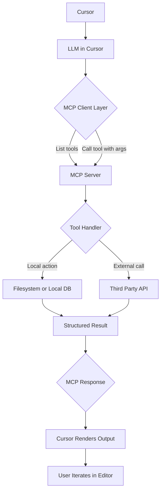

## Overview

This hackathon is about building **MCP (Model Context Protocol) servers** that work inside **Cursor**. You can build in **any language or framework**. Python with **FastMCP** is a recommended setup because it is quick to prototype and easy to demo inside Cursor.

**What is MCP?** MCP is a protocol that allows AI assistants to safely access external data and tools. Think of it as a standardized way for LLMs to call functions, read data, and interact with services beyond their training data.

---

## Goals

- Learn how MCP plugs into Cursor
- Build and demo your own MCP server
- Explore unique ideas that go beyond existing connectors
- Create tools that enhance the coding workflow
- Understand the request/response flow between Cursor and MCP servers

---

## Architecture at a Glance



### How It Works Step-by-Step

1. **User interacts in Cursor**: You write a message in Cursor's chat
2. **Cursor discovers tools**: Cursor connects to your MCP server and lists available tools
3. **LLM decides to use a tool**: Based on your request, Claude decides which tool to call
4. **Tool execution**: Your server receives the request, validates parameters, and executes the tool
5. **Results returned**: Your tool returns structured data back to Cursor
6. **Cursor displays results**: The LLM uses the results to craft a response to you

### Key Components

**MCP Server** (your code):
- Exposes tools, resources, and prompts
- Validates input parameters
- Executes business logic
- Returns structured responses

**MCP Client** (Cursor):
- Discovers available tools
- Sends tool call requests
- Receives and displays results
- Manages the conversation context

---

## Getting Started

### Fast path in Python with FastMCP

```bash
# Clone the starter template
git clone https://github.com/modelcontextprotocol/fastmcp-starter
cd fastmcp-starter

# Install dependencies
pip install -r requirements.txt

# Run your server
python server.py
```

### Configure Cursor to Use Your Server

Add to `.cursor/mcp.json` (or create it if it doesn't exist):

```json
{
  "mcpServers": {
    "my-hackathon-server": {
      "command": "python",
      "args": ["/absolute/path/to/your/server.py"]
    }
  }
}
```

**Important tips:**
- Use absolute paths for reliability
- Name your server descriptively
- Restart Cursor completely after changes to mcp.json
- Check Cursor's MCP logs if your server doesn't appear

### Verifying Your Server Works

1. Open Cursor's command palette (Cmd/Ctrl+Shift+P)
2. Search for "MCP" to see if your server is loaded
3. Try chatting with Cursor and mention your tool by name
4. Check your server's stdout for connection logs

### Alternative: HTTP Transport (Advanced)

For remote servers or when stdio is problematic:

```python
if __name__ == "__main__":
    mcp.run(transport="http", host="127.0.0.1", port=8000)
```

Update `.cursor/mcp.json`:
```json
{
  "mcpServers": {
    "my-http-server": {
      "url": "http://127.0.0.1:8000/mcp"
    }
  }
}
```

---

## Use any language

If not using Python/FastMCP:
- Implement MCP request and response contracts
- Expose tools that accept JSON args
- Print stdout and read stdin as required by MCP
- Follow the JSON-RPC 2.0 format
- Handle these core methods: `initialize`, `tools/list`, `tools/call`

### Example MCP Response (Node.js/TypeScript)

```typescript
import { Server } from "@modelcontextprotocol/sdk/server/index.js";
import { StdioServerTransport } from "@modelcontextprotocol/sdk/server/stdio.js";

const server = new Server({
  name: "my-server",
  version: "1.0.0"
});

server.setRequestHandler(ListToolsRequestSchema, async () => ({
  tools: [{
    name: "my_tool",
    description: "Does something useful",
    inputSchema: {
      type: "object",
      properties: {
        input: { type: "string" }
      }
    }
  }]
}));

const transport = new StdioServerTransport();
await server.connect(transport);
```

---

## Tool Design Best Practices

### Keep Tools Focused

❌ Bad: One tool that does everything
```python
@mcp.tool
def do_everything(action: str, data: dict) -> dict:
    """Does many unrelated things based on action"""
    if action == "weather": ...
    elif action == "calendar": ...
    elif action == "email": ...
```

✅ Good: Separate, focused tools
```python
@mcp.tool
def get_weather(city: str) -> dict:
    """Get weather for a specific city"""
    ...

@mcp.tool
def get_calendar_events(date: str) -> list[dict]:
    """List calendar events for a date"""
    ...
```

### Return Structured Data

❌ Bad: Unstructured text
```python
@mcp.tool
def get_user(user_id: str) -> str:
    return f"User {user_id} is named John and is 30 years old"
```

✅ Good: Structured objects
```python
@mcp.tool
def get_user(user_id: str) -> dict:
    """Get user details"""
    return {
        "id": user_id,
        "name": "John",
        "age": 30,
        "active": True
    }
```

### Validate All Inputs

```python
from pydantic import Field
from typing import Annotated

@mcp.tool
def search_items(
    query: Annotated[str, Field(min_length=1, max_length=100)],
    limit: Annotated[int, Field(ge=1, le=100)] = 10,
    category: Literal["all", "active", "archived"] = "all"
) -> list[dict]:
    """Search items with validation"""
    # Input is guaranteed to be valid here
    ...
```

---

## Unique Project Ideas

Skip the obvious GitHub, Slack, Notion, and Gmail clones. Build something creative!

### Quick Wins (1-2 hours)
- **Mood Board MCP**: Input a vibe like "cozy autumn coding". Return curated Unsplash/Pexels links
- **Emoji Mapper MCP**: Annotate any paragraph with contextually fitting emojis
- **Commit Poem MCP**: Turn git commit messages into haikus or limericks
- **Snippet Swap MCP**: Query a local JSON/SQLite store for code snippets by topic

### Medium Complexity (2-4 hours)
- **Weather + Vibes MCP**: Get local forecast and pair it with matching focus playlist links
- **Regex Builder MCP**: Convert plain English rules into working regex with test cases
- **Persona Generator MCP**: Produce UX persona objects from one-line descriptions
- **Denver Coffee Crawl MCP**: Return top indie coffee shops by neighborhood with ratings

### Advanced (4+ hours)
- **Code Smell Detector MCP**: Analyze code for patterns, return suggestions with severity scores
- **API Design Helper MCP**: Generate REST endpoint specs from natural language descriptions
- **Test Case Generator MCP**: Create comprehensive test cases from function signatures
- **Documentation Analyzer MCP**: Scan codebases, identify undocumented functions

### What Makes a Great Demo?

1. **Clear value proposition**: Solve a real problem or delight users
2. **Fast response times**: Tools should complete in < 2 seconds ideally
3. **Error handling**: Show graceful failures, not stack traces
4. **Multiple related tools**: 3-5 tools that work together is better than 1
5. **Good examples**: Have sample queries ready that show off your server

---

## Common Patterns and Examples

### Pattern 1: External API Wrapper

```python
import httpx
from fastmcp import FastMCP

mcp = FastMCP(name="WeatherServer")

@mcp.tool
async def get_weather(city: str, units: Literal["metric", "imperial"] = "metric") -> dict:
    """Get current weather for a city"""
    async with httpx.AsyncClient() as client:
        response = await client.get(
            f"https://api.weather.com/v1/current",
            params={"city": city, "units": units}
        )
        return response.json()
```

### Pattern 2: Local Data Store

```python
import json
from pathlib import Path

mcp = FastMCP(name="SnippetServer")

SNIPPETS_FILE = Path("snippets.json")

@mcp.tool
def search_snippets(topic: str) -> list[dict]:
    """Search code snippets by topic"""
    with SNIPPETS_FILE.open() as f:
        snippets = json.load(f)
    return [s for s in snippets if topic.lower() in s["topic"].lower()]

@mcp.tool
def add_snippet(topic: str, code: str, description: str) -> dict:
    """Add a new code snippet"""
    with SNIPPETS_FILE.open() as f:
        snippets = json.load(f)
    
    new_snippet = {
        "id": len(snippets) + 1,
        "topic": topic,
        "code": code,
        "description": description
    }
    snippets.append(new_snippet)
    
    with SNIPPETS_FILE.open("w") as f:
        json.dump(snippets, f, indent=2)
    
    return new_snippet
```

### Pattern 3: File System Operations

```python
from pathlib import Path
from fastmcp import FastMCP

mcp = FastMCP(name="FileServer")

@mcp.tool
def list_files(directory: str, pattern: str = "*") -> list[str]:
    """List files in a directory matching a pattern"""
    path = Path(directory).expanduser()
    if not path.exists():
        raise ValueError(f"Directory {directory} does not exist")
    return [str(f) for f in path.glob(pattern)]

@mcp.tool
def read_file(filepath: str, lines: int | None = None) -> str:
    """Read file contents, optionally limiting to first N lines"""
    path = Path(filepath).expanduser()
    content = path.read_text()
    if lines:
        return "\n".join(content.split("\n")[:lines])
    return content
```

---

## Debugging and Troubleshooting

### Server Not Appearing in Cursor?

1. **Check mcp.json syntax**: Must be valid JSON
2. **Use absolute paths**: Relative paths often fail
3. **Restart Cursor completely**: Quit and reopen, don't just reload
4. **Check server runs standalone**: `python server.py` should work without errors
5. **Check Cursor logs**: Help > Toggle Developer Tools > Console tab

### Server Crashes on Startup?

- Missing dependencies: `pip install -r requirements.txt`
- Python version: FastMCP requires Python 3.10+
- Import errors: Check all imports are available
- Check stderr output for stack traces

### Tools Not Being Called?

- Tool descriptions should be clear and specific
- Parameter names should be intuitive
- Try explicitly mentioning the tool name in your chat
- Check if LLM can see your tools: "What tools do you have available?"

### Getting Error Responses?

```python
from fastmcp.exceptions import ToolError

@mcp.tool
def my_tool(param: str) -> dict:
    """My tool with good error handling"""
    try:
        # Your logic here
        if not param:
            raise ToolError("Parameter cannot be empty")
        return {"result": "success"}
    except Exception as e:
        # Log the error for debugging
        print(f"Error in my_tool: {e}")
        # Return user-friendly error
        raise ToolError(f"Failed to process request: {str(e)}")
```

### Testing Your Tools

```python
# test_server.py
import pytest
from server import mcp

@pytest.mark.asyncio
async def test_my_tool():
    result = await mcp.call_tool("my_tool", {"param": "test"})
    assert result["result"] == "success"

# Run with: pytest test_server.py
```

---

## Demo Preparation Checklist

- [ ] Server starts without errors
- [ ] All tools have clear descriptions
- [ ] Sample queries prepared and tested
- [ ] Error cases handled gracefully
- [ ] Response times are acceptable (< 2s)
- [ ] Cursor configuration is correct
- [ ] README explains what the server does
- [ ] Demo data/API keys are ready
- [ ] At least 3 different use cases prepared
- [ ] Tested with actual conversations in Cursor

### Great Demo Flow

1. **Show the problem**: "When coding, I often need to..."
2. **Introduce your solution**: "I built an MCP server that..."
3. **Live demo in Cursor**: Show 2-3 realistic interactions
4. **Highlight unique features**: "Unlike existing tools, this..."
5. **Show the code**: Brief walkthrough of key implementation

---

## Rules and Format

- Use any language or framework
- Python with FastMCP is recommended for speed
- Solo or teams of up to three
- Judging criteria:
    - **Utility** (40%): Does it solve a real problem?
    - **Creativity** (30%): Is it unique and interesting?
    - **Execution inside Cursor** (30%): Does it work smoothly?

### What Judges Look For

**Utility:**
- Solves a genuine workflow problem
- Could see myself using this regularly
- Saves time or adds capability

**Creativity:**
- Novel idea or novel approach to common problem
- Not just another API wrapper
- Shows understanding of what makes MCP powerful

**Execution:**
- Works reliably in demo
- Clean, understandable code
- Good error handling
- Fast response times

---

## Resources

**Essential:**
- Cursor Docs: https://cursor.sh/docs
- FastMCP Docs: https://gofastmcp.com
- MCP Specification: https://spec.modelcontextprotocol.io
- FastMCP GitHub: https://github.com/jlowin/fastmcp

**Example Servers:**
- Official MCP Servers: https://github.com/modelcontextprotocol
- FastMCP Examples: https://github.com/jlowin/fastmcp/tree/main/examples

**Community:**
- FastMCP Discord: https://discord.gg/fastmcp
- MCP Community: https://github.com/modelcontextprotocol/servers

---

## Quick Reference

### Minimal Server Template

```python
from fastmcp import FastMCP

mcp = FastMCP(name="MyServer")

@mcp.tool
def my_tool(input: str) -> dict:
    """Tool description here"""
    return {"result": input.upper()}

if __name__ == "__main__":
    mcp.run()
```

### Common Type Patterns

```python
# Simple types
def tool(text: str, count: int, active: bool) -> dict: ...

# Optional parameters
def tool(text: str, limit: int = 10, filter: str | None = None) -> dict: ...

# Constrained values
def tool(mode: Literal["fast", "slow", "auto"] = "auto") -> dict: ...

# Complex objects
from pydantic import BaseModel

class Config(BaseModel):
    name: str
    value: int

def tool(config: Config) -> dict: ...

# Lists and dicts
def tool(items: list[str], metadata: dict[str, str]) -> dict: ...
```

---

## Let's Build

Keep the scope tight. Make it work in Cursor. Demo proudly.

**Remember:** A working demo of a simple, useful tool beats a complex, broken system every time.

**Time management tip:** Spend 60% of time on core functionality, 30% on polish and error handling, 10% on demo preparation.

**Good luck!** 🚀
